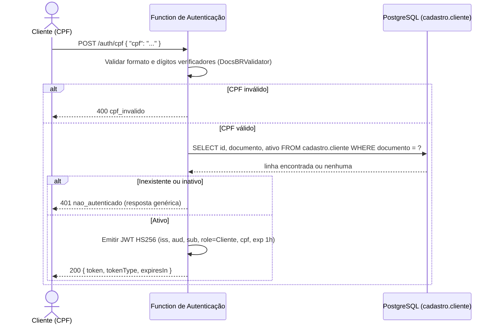
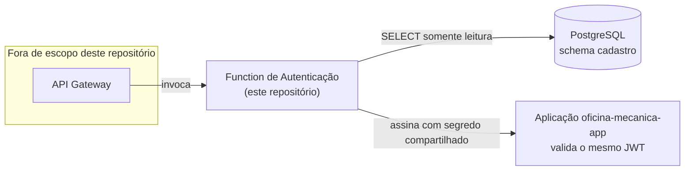

# oficina-mecanica-lambda-auth

Function Serverless de autenticação por CPF do **Sistema de Oficina Mecânica** — Tech Challenge da
pós-graduação em Arquitetura de Software (FIAP/SOAT), Fase 3.

Este componente é um dos dois emissores de token do sistema (RFC-001 do repositório da aplicação):
recebe um CPF, valida-o, consulta se existe um cliente ativo com esse documento e, em caso
positivo, emite um JWT que a aplicação principal ([`oficina-mecanica-app`](https://github.com/gabrielMauad/oficina-mecanica-app))
aceita para as rotas do papel `Cliente`.

---

## Índice

- [Propósito](#propósito)
- [Tecnologias utilizadas](#tecnologias-utilizadas)
- [Diagrama do componente](#diagrama-do-componente)
- [Pré-requisitos](#pré-requisitos)
- [Configuração](#configuração)
- [Execução local](#execução-local)
- [Como testar](#como-testar)
- [Exemplo de requisição e resposta](#exemplo-de-requisição-e-resposta)
- [Pipeline (CI/CD)](#pipeline-cicd)
- [Deploy](#deploy)
- [Decisões e pontos em aberto](#decisões-e-pontos-em-aberto)

---

## Propósito

Implementa as três responsabilidades atribuídas à Function pelo RFC-001 do repositório da
aplicação:

1. **Validar o CPF** — formato e dígitos verificadores, usando o mesmo pacote NuGet
   (`DocsBRValidator`) que o domínio `Cadastro` da aplicação usa em `Cpf.Criar`. Isso elimina o
   risco de as duas regras divergirem.
2. **Consultar `cadastro.cliente` diretamente no PostgreSQL** — decisão do
   [ADR-002](https://github.com/gabrielMauad/oficina-mecanica-app/blob/main/docs/arquitetura/adrs/002-lambda-le-o-banco-diretamente.md)
   da aplicação: é uma exceção deliberada ao isolamento entre bounded contexts, restrita ao fluxo
   de autenticação. A Function só executa `SELECT` e usa um usuário de banco com permissão
   exclusiva de leitura nessa tabela.
3. **Emitir um JWT HS256** assinado com um segredo simétrico compartilhado com a aplicação
   ([ADR-001](https://github.com/gabrielMauad/oficina-mecanica-app/blob/main/docs/arquitetura/adrs/001-jwt-hs256-segredo-compartilhado.md)),
   seguindo o contrato de claims do RFC-001 §4.1.

CPF inválido, cliente inexistente e cliente inativo são as três respostas de erro. **Inexistente e
inativo devolvem a mesma resposta genérica** — de propósito, para que o endpoint não vire um
verificador de cadastro de clientes.

## Tecnologias utilizadas

| Tecnologia | Uso |
|---|---|
| **.NET 8** (`net8.0`) | Runtime gerenciado do AWS Lambda é `dotnet8`. A aplicação principal usa .NET 10, mas isso exigiria imagem de contêiner ou runtime customizado na Lambda — desproporcional para uma function com essa responsabilidade. Ver [Decisões](#decisões-e-pontos-em-aberto). |
| `Amazon.Lambda.Core` + `Amazon.Lambda.Serialization.SystemTextJson` + `Amazon.Lambda.APIGatewayEvents` | Handler e (de)serialização compatíveis com API Gateway **HTTP API** (payload v2). |
| **Npgsql** | Acesso direto ao PostgreSQL via ADO.NET puro — sem Entity Framework, porque é uma única consulta e a Lambda não deve carregar o modelo de domínio da aplicação. |
| `System.IdentityModel.Tokens.Jwt` | Mesma biblioteca de assinatura que `Autenticacao.Infrastructure.Services.JwtTokenService` usa na aplicação, para reduzir risco de divergência no formato do token. |
| **DocsBRValidator** | Mesmo pacote que `Cadastro.Domain.Cliente.Cpf` usa na aplicação para validar CPF. |
| **xUnit** | Testes unitários. |
| **Testcontainers.PostgreSql** | Testes de integração contra um PostgreSQL real. |

## Diagrama do componente





## Pré-requisitos

- [.NET 8 SDK](https://dotnet.microsoft.com/download/dotnet/8.0)
- [Docker](https://www.docker.com/) — necessário para os testes de integração (Testcontainers) e
  para subir um PostgreSQL local
- Acesso de rede a um PostgreSQL com o schema `cadastro` da aplicação (local, via Docker, ou o
  banco de desenvolvimento da aplicação)

## Configuração

Toda a configuração vem de **variáveis de ambiente** — nada de segredo ou string de conexão fica
hardcoded no repositório:

| Variável | Descrição |
|---|---|
| `JWT_SECRET` | Segredo simétrico compartilhado com a aplicação (ADR-001). |
| `JWT_ISSUER` | `oficina-mecanica-auth`, conforme o contrato do RFC-001 §4.1. |
| `JWT_AUDIENCE` | `oficina-mecanica-api`. |
| `DB_CONNECTION_STRING` | String de conexão Npgsql para o PostgreSQL da aplicação. |

Na nuvem, esses quatro valores devem vir do **AWS Secrets Manager** (injetados como variável de
ambiente da Lambda a partir de um secret, não digitados na configuração da function). O
`DB_CONNECTION_STRING` deve apontar para um **usuário de banco com permissão apenas de `SELECT`**
em `cadastro.cliente` — nunca o usuário de aplicação, que tem escrita.

## Execução local

```bash
# Subir um PostgreSQL local com o schema da aplicação (ajuste a imagem/porta conforme seu setup)
docker run -d --name oficina-mecanica-db -e POSTGRES_PASSWORD=postgres -p 5432:5432 postgres:16-alpine

# Aplicar o schema — na aplicação real, isso é feito pelas migrations do EF Core
# (ver docs/arquitetura/adrs/002-lambda-le-o-banco-diretamente.md). Para uma verificação manual
# rápida, o DDL usado nos testes de integração desta Lambda está em
# test/OficinaMecanica.LambdaAuth.IntegrationTests/Schema/cadastro_cliente.sql

export JWT_SECRET="segredo-de-desenvolvimento-com-tamanho-suficiente-para-hs256"
export JWT_ISSUER="oficina-mecanica-auth"
export JWT_AUDIENCE="oficina-mecanica-api"
export DB_CONNECTION_STRING="Host=localhost;Port=5432;Database=postgres;Username=postgres;Password=postgres"

dotnet build -c Release
```

A Function não expõe um servidor HTTP local por padrão — é um handler de Lambda. Para invocá-la
localmente sem subir infraestrutura AWS, use o
[Amazon.Lambda.TestTool](https://github.com/aws/aws-lambda-dotnet/tree/master/Tools/LambdaTestTool)
ou construa o `Function` diretamente em um teste/console apontando as variáveis de ambiente acima
— é exatamente o que os testes de integração deste repositório fazem (sem o TestTool, chamando
`AuthenticationService` diretamente contra um Postgres real via Testcontainers).

## Como testar

```bash
# Só os testes unitários (não precisam de Docker)
dotnet test test/OficinaMecanica.LambdaAuth.UnitTests

# Suíte completa, incluindo integração — Docker precisa estar rodando
dotnet test
```

- **Unitários**: validação de CPF (válido, dígito verificador errado, sequência repetida),
  montagem do token (todas as claims do contrato, algoritmo, expiração) e o comportamento de erro
  genérico para cliente inexistente/inativo.
- **Integração**: sobe um PostgreSQL via Testcontainers, aplica a cópia do schema de
  `cadastro.cliente` e exercita os três caminhos (ativo, inativo, inexistente) contra o banco real.

## Exemplo de requisição e resposta

**Requisição** (corpo recebido via API Gateway HTTP API, payload v2):

```json
POST /auth/cpf
Content-Type: application/json

{
  "cpf": "123.456.789-09"
}
```

**Sucesso — cliente ativo (200):**

```json
{
  "token": "eyJhbGciOiJIUzI1NiIsInR5cCI6IkpXVCJ9...",
  "tokenType": "Bearer",
  "expiresIn": 3600
}
```

**CPF inválido (400):**

```json
{
  "erro": "cpf_invalido",
  "mensagem": "CPF invalido."
}
```

**Cliente inexistente ou inativo — mesma resposta genérica (401):**

```json
{
  "erro": "nao_autenticado",
  "mensagem": "Nao foi possivel autenticar com o CPF informado."
}
```

## Pipeline (CI/CD)

Workflow em `.github/workflows/ci.yml`, GitHub Actions:

- **Em Pull Request**: restore, build e testes (unitários + integração com Testcontainers, Docker
  já vem disponível nos runners `ubuntu-latest`). Este job (`build-and-test`) é o **status check
  obrigatório** da branch `main`.
- **Em push na `main`** (após merge do PR): repete build e testes e, adicionalmente, publica a
  function (`dotnet publish`) e empacota o resultado em um `.zip`, disponibilizado como artefato
  do workflow — pronto para um futuro `aws lambda update-function-code`.
- **Deploy para a AWS**: job comentado no workflow. Depende de infraestrutura (API Gateway, role
  de execução da Lambda, secret no Secrets Manager, acesso de rede ao PostgreSQL) que ainda não
  existe e é responsabilidade de outro repositório/etapa. O comentário no workflow documenta o que
  falta para ativá-lo.

## Deploy

Fora do escopo deste repositório (ver [Fora de escopo](#decisões-e-pontos-em-aberto)). O artefato
gerado pela pipeline (`oficina-mecanica-lambda-auth.zip`) é o que uma etapa de infraestrutura
publicaria com `aws lambda create-function`/`update-function-code`, usando o handler configurado
em `src/OficinaMecanica.LambdaAuth/aws-lambda-tools-defaults.json`
(`OficinaMecanica.LambdaAuth::OficinaMecanica.LambdaAuth.Function::FunctionHandler`) e o runtime
gerenciado `dotnet8`.

## Decisões e pontos em aberto

- **.NET 8, não .NET 10.** O runtime gerenciado do AWS Lambda é `dotnet8`; usar .NET 10 exigiria
  empacotar a function como imagem de contêiner ou runtime customizado, custo que não se justifica
  para este componente.
- **Sem Dockerfile.** O runtime gerenciado do Lambda é entregue como `.zip`, não como imagem — a
  orientação da fase é incluir `Dockerfile` só onde for tecnicamente necessário, e aqui não é.
- **Leitura direta do banco (ADR-002)** é uma exceção deliberada ao isolamento entre bounded
  contexts que o projeto defende desde a Fase 2. Aceita conscientemente e restrita ao fluxo de
  autenticação — autenticadores de mercado (Cognito, Keycloak) leem seu próprio store diretamente.
- **Deriva de schema conhecida.** O DDL em
  `test/OficinaMecanica.LambdaAuth.IntegrationTests/Schema/cadastro_cliente.sql` é uma **cópia
  manual** do trecho relevante da migration EF Core da aplicação (comentário no próprio arquivo
  aponta a fonte). Se a aplicação renomear uma coluna ou mudar um tipo em `cadastro.cliente`, só
  esta cópia desatualizada vai fazer o teste de integração desta Lambda quebrar — não há nada que
  atualize essa cópia automaticamente. Uma forma de fechar essa lacuna depois: rodar as migrations
  reais da aplicação (via `dotnet ef database update` ou o pacote de migrations do EF Core) contra
  o container do Testcontainers no CI desta Lambda, em vez de manter uma cópia estática do DDL —
  isso exigiria que este repositório dependesse do pacote de migrations publicado pela aplicação
  (ou de acesso ao código-fonte dela em CI), o que foi considerado fora de escopo nesta primeira
  versão.
- **Fora de escopo** (por decisão explícita do RFC-001 e do enunciado da fase): API Gateway,
  Terraform ou qualquer outro recurso de infraestrutura AWS; endpoint de refresh token; cadastro
  de cliente; qualquer alteração no repositório da aplicação.
