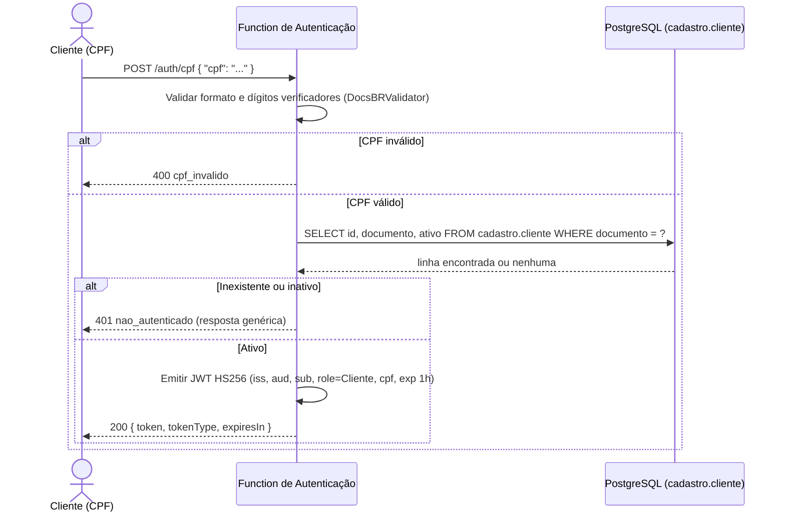
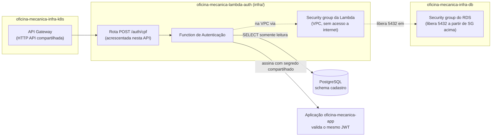

# oficina-mecanica-lambda-auth

Function Serverless de autenticação por CPF do **Sistema de Oficina Mecânica** — Tech Challenge da
pós-graduação em Arquitetura de Software (FIAP/SOAT), Fase 3.

Este componente é um dos dois emissores de token do sistema (RFC-001 do repositório da aplicação):
recebe um CPF, valida-o, consulta se existe um cliente ativo com esse documento e, em caso
positivo, emite um JWT que a aplicação principal ([`oficina-mecanica-app`](https://github.com/gabrielMauad/oficina-mecanica-app))
aceita para as rotas do papel `Cliente`.

---

## Índice

- [Propósito](#propósito)
- [Tecnologias utilizadas](#tecnologias-utilizadas)
- [Diagrama do componente](#diagrama-do-componente)
- [Pré-requisitos](#pré-requisitos)
- [Configuração](#configuração)
- [Execução local](#execução-local)
- [Como testar](#como-testar)
- [Exemplo de requisição e resposta](#exemplo-de-requisição-e-resposta)
- [Pipeline (CI/CD)](#pipeline-cicd)
- [Deploy](#deploy)
- [Limitações conhecidas](#limitações-conhecidas)
- [Decisões e pontos em aberto](#decisões-e-pontos-em-aberto)

---

## Propósito

Implementa as três responsabilidades atribuídas à Function pelo RFC-001 do repositório da
aplicação:

1. **Validar o CPF** — formato e dígitos verificadores, usando o mesmo pacote NuGet
   (`DocsBRValidator`) que o domínio `Cadastro` da aplicação usa em `Cpf.Criar`. Isso elimina o
   risco de as duas regras divergirem.
2. **Consultar `cadastro.cliente` diretamente no PostgreSQL** — decisão do
   [ADR-002](https://github.com/gabrielMauad/oficina-mecanica-app/blob/main/docs/arquitetura/adrs/002-lambda-le-o-banco-diretamente.md)
   da aplicação: é uma exceção deliberada ao isolamento entre bounded contexts, restrita ao fluxo
   de autenticação. A Function só executa `SELECT` e usa um usuário de banco com permissão
   exclusiva de leitura nessa tabela.
3. **Emitir um JWT HS256** assinado com um segredo simétrico compartilhado com a aplicação
   ([ADR-001](https://github.com/gabrielMauad/oficina-mecanica-app/blob/main/docs/arquitetura/adrs/001-jwt-hs256-segredo-compartilhado.md)),
   seguindo o contrato de claims do RFC-001 §4.1.

CPF inválido, cliente inexistente e cliente inativo são as três respostas de erro. **Inexistente e
inativo devolvem a mesma resposta genérica** — de propósito, para que o endpoint não vire um
verificador de cadastro de clientes.

## Tecnologias utilizadas

| Tecnologia | Uso |
|---|---|
| **.NET 8** (`net8.0`) | Runtime gerenciado do AWS Lambda é `dotnet8`. A aplicação principal usa .NET 10, mas isso exigiria imagem de contêiner ou runtime customizado na Lambda — desproporcional para uma function com essa responsabilidade. Ver [Decisões](#decisões-e-pontos-em-aberto). |
| `Amazon.Lambda.Core` + `Amazon.Lambda.Serialization.SystemTextJson` + `Amazon.Lambda.APIGatewayEvents` | Handler e (de)serialização compatíveis com API Gateway **HTTP API** (payload v2). |
| **Npgsql** | Acesso direto ao PostgreSQL via ADO.NET puro — sem Entity Framework, porque é uma única consulta e a Lambda não deve carregar o modelo de domínio da aplicação. |
| `System.IdentityModel.Tokens.Jwt` | Mesma biblioteca de assinatura que `Autenticacao.Infrastructure.Services.JwtTokenService` usa na aplicação, para reduzir risco de divergência no formato do token. |
| **DocsBRValidator** | Mesmo pacote que `Cadastro.Domain.Cliente.Cpf` usa na aplicação para validar CPF. |
| **xUnit** | Testes unitários. |
| **Testcontainers.PostgreSql** | Testes de integração contra um PostgreSQL real. |
| **Terraform** ≥ 1.5, provider `hashicorp/aws` ~> 5.0 | IaC da Lambda, seu security group e a integração/rota no API Gateway (pasta [`infra/`](infra/)) |
| **GitHub Actions** | CI de build/teste/validação (PR) e package + apply (push/dispatch na `main`) |

## Diagrama do componente


```mermaid
sequenceDiagram
    actor Cliente as Cliente (CPF)
    participant Lambda as Function de Autenticação
    participant DB as PostgreSQL (cadastro.cliente)

    Cliente->>Lambda: POST /auth/cpf { "cpf": "..." }
    Lambda->>Lambda: Validar formato e dígitos verificadores (DocsBRValidator)
    alt CPF inválido
        Lambda-->>Cliente: 400 cpf_invalido
    else CPF válido
        Lambda->>DB: SELECT id, documento, ativo FROM cadastro.cliente WHERE documento = ?
        DB-->>Lambda: linha encontrada ou nenhuma
        alt Inexistente ou inativo
            Lambda-->>Cliente: 401 nao_autenticado (resposta genérica)
        else Ativo
            Lambda->>Lambda: Emitir JWT HS256 (iss, aud, sub, role=Cliente, cpf, exp 1h)
            Lambda-->>Cliente: 200 { token, tokenType, expiresIn }
        end
    end
```


```mermaid
flowchart LR
    subgraph "oficina-mecanica-infra-k8s"
        GW["API Gateway<br/>(HTTP API compartilhada)"]
    end
    subgraph "oficina-mecanica-lambda-auth (infra/)"
        ROUTE["Rota POST /auth/cpf<br/>(acrescentada nesta API)"]
        SG["Security group da Lambda<br/>(VPC, sem acesso a internet)"]
        FN["Function de Autenticação"]
    end
    subgraph "oficina-mecanica-infra-db"
        RDSSG["Security group do RDS<br/>(libera 5432 a partir de SG acima)"]
    end
    GW --> ROUTE --> FN
    FN -.na VPC via.-> SG -.libera 5432 em.-> RDSSG
    FN -->|SELECT somente leitura| DB[(PostgreSQL<br/>schema cadastro)]
    FN -->|assina com segredo compartilhado| APP[Aplicação oficina-mecanica-app<br/>valida o mesmo JWT]
```

## Pré-requisitos

- [.NET 8 SDK](https://dotnet.microsoft.com/download/dotnet/8.0)
- [Docker](https://www.docker.com/) — necessário para os testes de integração (Testcontainers) e
  para subir um PostgreSQL local
- Acesso de rede a um PostgreSQL com o schema `cadastro` da aplicação (local, via Docker, ou o
  banco de desenvolvimento da aplicação)

## Configuração

Toda a configuração vem de **variáveis de ambiente** — nada de segredo ou string de conexão fica
hardcoded no repositório:

| Variável | Descrição |
|---|---|
| `JWT_SECRET` | Segredo simétrico compartilhado com a aplicação (ADR-001). |
| `JWT_ISSUER` | `oficina-mecanica-auth`, conforme o contrato do RFC-001 §4.1. |
| `JWT_AUDIENCE` | `oficina-mecanica-api`. |
| `DB_CONNECTION_STRING` | String de conexão Npgsql para o PostgreSQL da aplicação. |

Na nuvem (Terraform em [`infra/`](infra/)), esses quatro valores são **resolvidos pelo Terraform no
apply**, a partir dos secrets `oficina-mecanica/dev/rds/postgresql`
(`oficina-mecanica-infra-db`) e `oficina-mecanica/dev/app` (`oficina-mecanica-infra-k8s`), lidos
por **nome** via `data "aws_secretsmanager_secret_version"`, e gravados como variáveis de ambiente
da function (`infra/lambda.tf`). **Não é a Lambda que busca o segredo em runtime** — ver
[Limitações conhecidas](#limitações-conhecidas) para o motivo (a VPC desta conta não tem NAT
Gateway) e a consequência (os valores ficam na configuração da function e no state do Terraform).

`DB_CONNECTION_STRING` inclui `SSL Mode=Require` — o RDS PostgreSQL 16 desta conta exige TLS por
padrão (`rds.force_ssl = 1`); sem isso a conexão é recusada.

## Execução local

```bash
# Subir um PostgreSQL local com o schema da aplicação (ajuste a imagem/porta conforme seu setup)
docker run -d --name oficina-mecanica-db -e POSTGRES_PASSWORD=postgres -p 5432:5432 postgres:16-alpine

# Aplicar o schema — na aplicação real, isso é feito pelas migrations do EF Core
# (ver docs/arquitetura/adrs/002-lambda-le-o-banco-diretamente.md). Para uma verificação manual
# rápida, o DDL usado nos testes de integração desta Lambda está em
# test/OficinaMecanica.LambdaAuth.IntegrationTests/Schema/cadastro_cliente.sql

export JWT_SECRET="segredo-de-desenvolvimento-com-tamanho-suficiente-para-hs256"
export JWT_ISSUER="oficina-mecanica-auth"
export JWT_AUDIENCE="oficina-mecanica-api"
export DB_CONNECTION_STRING="Host=localhost;Port=5432;Database=postgres;Username=postgres;Password=postgres"

dotnet build -c Release
```

A Function não expõe um servidor HTTP local por padrão — é um handler de Lambda. Para invocá-la
localmente sem subir infraestrutura AWS, use o
[Amazon.Lambda.TestTool](https://github.com/aws/aws-lambda-dotnet/tree/master/Tools/LambdaTestTool)
ou construa o `Function` diretamente em um teste/console apontando as variáveis de ambiente acima
— é exatamente o que os testes de integração deste repositório fazem (sem o TestTool, chamando
`AuthenticationService` diretamente contra um Postgres real via Testcontainers).

## Como testar

```bash
# Só os testes unitários (não precisam de Docker)
dotnet test test/OficinaMecanica.LambdaAuth.UnitTests

# Suíte completa, incluindo integração — Docker precisa estar rodando
dotnet test
```

- **Unitários**: validação de CPF (válido, dígito verificador errado, sequência repetida),
  montagem do token (todas as claims do contrato, algoritmo, expiração) e o comportamento de erro
  genérico para cliente inexistente/inativo.
- **Integração**: sobe um PostgreSQL via Testcontainers, aplica a cópia do schema de
  `cadastro.cliente` e exercita os três caminhos (ativo, inativo, inexistente) contra o banco real.

## Exemplo de requisição e resposta

**Requisição** (corpo recebido via API Gateway HTTP API, payload v2):

```json
POST /auth/cpf
Content-Type: application/json

{
  "cpf": "123.456.789-09"
}
```

**Sucesso — cliente ativo (200):**

```json
{
  "token": "eyJhbGciOiJIUzI1NiIsInR5cCI6IkpXVCJ9...",
  "tokenType": "Bearer",
  "expiresIn": 3600
}
```

**CPF inválido (400):**

```json
{
  "erro": "cpf_invalido",
  "mensagem": "CPF invalido."
}
```

**Cliente inexistente ou inativo — mesma resposta genérica (401):**

```json
{
  "erro": "nao_autenticado",
  "mensagem": "Nao foi possivel autenticar com o CPF informado."
}
```

**Documentação da API completa.** Esta Function não tem Swagger/OpenAPI própria — é uma única
rota simples, documentada acima. Para o restante da API (as rotas protegidas pelo token que esta
Function emite), o repositório `oficina-mecanica-app` publica:

- A [collection Bruno](https://github.com/gabrielMauad/oficina-mecanica-app/blob/main/docs/guias/collection_bruno.yml)
  com todos os endpoints da aplicação — inclui a rota de login da oficina (`POST /auth/login`,
  papel `Oficina`), mas **não** inclui uma requisição para `POST /auth/cpf` desta Function (a
  collection tem um comentário explicando como gerar manualmente um token de papel `Cliente`
  enquanto isso).
- **Scalar/OpenAPI** (`<endpoint>/scalar`), servido pela própria aplicação atrás do **mesmo** API
  Gateway desta Lambda — descubra `<endpoint>` com o comando `aws apigatewayv2 get-apis` da seção
  "Descobrir a URL de autenticação" abaixo (é o mesmo endpoint de `POST /auth/cpf`, só troca o
  caminho).

## Pipeline (CI/CD)

Workflow em [`.github/workflows/ci.yml`](.github/workflows/ci.yml), GitHub Actions:

- **`build-and-test`** (todo Pull Request e push): restore, build e testes (unitários + integração
  com Testcontainers, Docker já vem disponível nos runners `ubuntu-latest`). **Status check
  obrigatório** da branch `main`.
- **`terraform-validate`** (todo Pull Request e push): `terraform fmt -check`, `terraform init
  -backend=false` e `terraform validate` em [`infra/`](infra/) — não exige credenciais AWS.
- **`package`** (push na `main` ou `workflow_dispatch`, depende de `build-and-test`): publica a
  function (`dotnet publish`) e empacota o resultado em `oficina-mecanica-lambda-auth.zip`,
  disponibilizado como artefato do workflow.
- **`deploy`** (push na `main` ou `workflow_dispatch`, depende de `terraform-validate` e
  `package`): baixa o zip empacotado, autentica com `aws-actions/configure-aws-credentials`
  (**credenciais de sessão temporárias** da conta AWS Academy — não OIDC/IAM role, que esta conta
  não permite criar, ADR-006) e roda `terraform init` + `terraform apply` em `infra/`, publicando
  a Lambda, o security group e a rota no API Gateway. Termina com um smoke test: descobre o
  endpoint da API pelo **nome** (`aws apigatewayv2 get-apis`) e faz `POST /auth/cpf` com um CPF
  válido porém inexistente, esperando **401** — um 504 nessa etapa indica problema de rede entre a
  Lambda e o RDS, não falta de dado.
- As credenciais de sessão expiram com a sessão do laboratório: se `deploy` falhar na
  autenticação, é preciso renovar os três secrets e reexecutar via `workflow_dispatch` — não é
  pipeline quebrada (ADR-006).

## Deploy

O Terraform em [`infra/`](infra/) provisiona a `aws_lambda_function`, o security group da Lambda
na VPC (necessário para alcançar o RDS, que não é público — ADR-002) e a integração/rota
`POST /auth/cpf` na HTTP API já criada por `oficina-mecanica-infra-k8s`. Ver os comentários em cada
arquivo de `infra/` para o desenho completo.

### Ordem de deploy

Este repositório **depende** de `oficina-mecanica-infra-k8s` (VPC, subnets, a própria HTTP API) e
`oficina-mecanica-infra-db` (security group do RDS) já aplicados — ele lê os states deles via
`terraform_remote_state`. Ordem de merge/apply completa:

```
oficina-mecanica-infra-k8s → oficina-mecanica-infra-db → oficina-mecanica-app → oficina-mecanica-lambda-auth
```

A Lambda vem depois da aplicação porque o fluxo completo de login por CPF só é demonstrável depois
que as migrations da aplicação criarem `cadastro.cliente` no RDS.

### Pré-requisitos de execução

- [Terraform](https://developer.hashicorp.com/terraform/downloads) ≥ 1.5 (mesma versão usada nos
  outros dois repositórios de infraestrutura).
- Uma sessão ativa da AWS Academy Learner Lab, com as credenciais de sessão exportadas.
- O mesmo bucket S3 do state compartilhado (`TF_STATE_BUCKET`) usado por `oficina-mecanica-infra-k8s`
  e `oficina-mecanica-infra-db`, já com os states deles aplicados.
- O zip de deploy publicado (`dotnet publish` + `zip`, job `package` do workflow).

### Instruções de execução (Terraform)

```bash
cd infra

terraform init \
  -backend-config="bucket=<mesmo-bucket-compartilhado>" \
  -backend-config="key=lambda-auth/terraform.tfstate" \
  -backend-config="region=us-east-1"

terraform apply \
  -var="tf_state_bucket=<mesmo-bucket-compartilhado>" \
  -var="lambda_zip_path=<caminho-do-zip-publicado>"
```

### Descobrir a URL de autenticação

Nunca fica hardcoded (muda a cada recriação da infraestrutura) — descubra pelo **nome** da API:

```bash
aws apigatewayv2 get-apis \
  --query "Items[?Name=='oficina-mecanica-api'].ApiEndpoint | [0]" \
  --output text
```

A rota de autenticação é `POST <endpoint>/auth/cpf`.

## Limitações conhecidas

- **A Lambda usa as credenciais do secret do RDS, não um usuário somente-leitura dedicado.**
  [ADR-002](https://github.com/gabrielMauad/oficina-mecanica-app/blob/main/docs/arquitetura/adrs/002-lambda-le-o-banco-diretamente.md)
  da aplicação prevê um usuário de banco dedicado, com permissão apenas de `SELECT` em
  `cadastro.cliente`. Criá-lo exige executar SQL (`CREATE USER`/`GRANT`) **dentro da VPC**, já que
  o RDS não é público — o que não é viável a partir do runner do GitHub Actions nesta etapa (não
  há um túnel/bastion provisionado para isso). Por isso, nesta etapa, `infra/lambda.tf` usa as
  mesmas credenciais (`username`/`password`) do secret `oficina-mecanica/dev/rds/postgresql` que a
  aplicação usa — a Lambda tem, na prática, permissão de escrita que nunca exerce (só faz
  `SELECT`, ver `ClienteRepository.cs`). Registrado como nota de execução no próprio ADR-002.
- **Os segredos de runtime da Lambda ficam na configuração da function e no state do Terraform.**
  A VPC desta conta AWS Academy não tem NAT Gateway (RFC-002), então a Lambda dentro da VPC não
  alcança o Secrets Manager em tempo de execução. A única forma possível aqui é resolver os
  segredos **no apply**, via `data "aws_secretsmanager_secret_version"`, e gravá-los como variável
  de ambiente da function (`infra/lambda.tf`). Consequência aceita: quem tiver acesso de leitura ao
  state do Terraform ou à configuração da function no console vê os valores em texto puro — mesmo
  nível de exposição que qualquer variável de ambiente de Lambda, mas vale registrar.

## Decisões e pontos em aberto

- **.NET 8, não .NET 10.** O runtime gerenciado do AWS Lambda é `dotnet8`; usar .NET 10 exigiria
  empacotar a function como imagem de contêiner ou runtime customizado, custo que não se justifica
  para este componente.
- **Sem Dockerfile.** O runtime gerenciado do Lambda é entregue como `.zip`, não como imagem — a
  orientação da fase é incluir `Dockerfile` só onde for tecnicamente necessário, e aqui não é.
- **Leitura direta do banco (ADR-002)** é uma exceção deliberada ao isolamento entre bounded
  contexts que o projeto defende desde a Fase 2. Aceita conscientemente e restrita ao fluxo de
  autenticação — autenticadores de mercado (Cognito, Keycloak) leem seu próprio store diretamente.
- **Deriva de schema conhecida.** O DDL em
  `test/OficinaMecanica.LambdaAuth.IntegrationTests/Schema/cadastro_cliente.sql` é uma **cópia
  manual** do trecho relevante da migration EF Core da aplicação (comentário no próprio arquivo
  aponta a fonte). Se a aplicação renomear uma coluna ou mudar um tipo em `cadastro.cliente`, só
  esta cópia desatualizada vai fazer o teste de integração desta Lambda quebrar — não há nada que
  atualize essa cópia automaticamente. Uma forma de fechar essa lacuna depois: rodar as migrations
  reais da aplicação (via `dotnet ef database update` ou o pacote de migrations do EF Core) contra
  o container do Testcontainers no CI desta Lambda, em vez de manter uma cópia estática do DDL —
  isso exigiria que este repositório dependesse do pacote de migrations publicado pela aplicação
  (ou de acesso ao código-fonte dela em CI), o que foi considerado fora de escopo nesta primeira
  versão.
- **Fora de escopo** (por decisão explícita do RFC-001 e do enunciado da fase): endpoint de
  refresh token; cadastro de cliente; qualquer alteração no repositório da aplicação. A HTTP API
  em si (recurso `aws_apigatewayv2_api`) continua fora deste repositório — pertence a
  `oficina-mecanica-infra-k8s`; este repositório só acrescenta sua própria integração/rota nela
  (`infra/apigateway.tf`).
